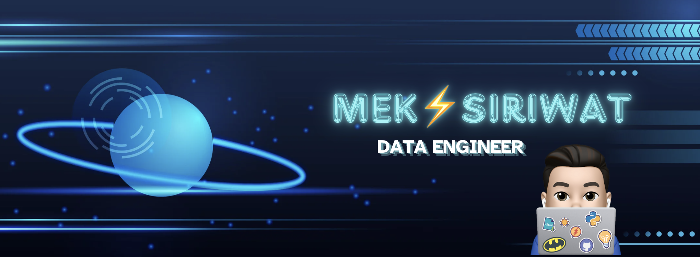

<h1 align="center">Hi there 👋, I'm Mek</h1>

    

<!-- <h2 align="center">Junior Data Engineer</h2> -->

As a passionate Junior Data Engineer, I specialize in leveraging data to drive impactful insights and solutions. I thrive on solving complex data challenges and enjoy working with diverse technologies to optimize data pipelines and workflows. With a strong foundation in data engineering tools and methodologies, I am particularly interested in exploring advancements in data science, cloud computing, and big data analytics. 

My goal is to contribute to innovative projects that harness the power of data to create meaningful outcomes and drive progress in various industries.

- 📫 How to reach me: swisetpakdeewong@gmail.com

- 📄 Know about my experiences: [https://www.linkedin.com/in/siriwat-wisetpakdeewong-78b641256/](https://www.linkedin.com/in/siriwat-wisetpakdeewong-78b641256/)

- ⭐️ View my resume: [Click Here](https://drive.google.com/file/d/1UP6nrpnJiu_JMxbAWhsqxt13RWENKJbf/view?usp=sharing)

<h3 align="left">🔗 Connect with me:</h3>

<!--  -->

<h3 align="left">💻 Languages and Tools:</h3>

## 🚀 Featured Projects

### 1. [<u>LiquorSales Data Migration Pipeline</u>](https://github.com/MekWiset/LiquorSales_Data_Migration_Pipeline)
- **ℹ️ Description:** Big Data Migration from GCP to Azure.
- **🏆 Achievements:** Successfully migrated over 19 million rows of data from Google Cloud Storage to Azure Data Lake, ensuring data integrity with zero data loss.
- **🎯 Technologies used:**
    - **Processing Tools:** PySpark
    - **GCP Services:** Google Cloud Storage (GCS), BigQuery
    - **Azure Services:** Azure Data Factory, Azure Data Lake Storage Gen 2, Databricks, Key Vault
    - **Others:** Docker

### 2. [<u>Medallion Data Lakehouse</u>](https://github.com/MekWiset/Medallion_DataLakehouse_project)
- **ℹ️ Description:** Building a Data Lakehouse using the Medallion architecture.
- **🏆 Achievements:** Developed a scalable Data Lakehouse architecture using the Medallion framework, facilitating efficient data storage, processing, and analysis with seamless integration across Azure services.
- **🎯 Technologies used:**
    - **Processing Tools:** DBT (Data Build Tool)
    - **Azure Services:** Azure SQL Database, Azure Data Lake Storage Gen 2, Databricks, Azure Key Vault

### 3. [<u>Realtime Data Streaming</u>](https://github.com/MekWiset/Realtime_Data_Streaming_project)
- **ℹ️ Description:** Real-time data ingestion to Cassandra using Airflow, Kafka, and Spark.
- **🏆 Achievements:** Engineered a robust real-time data streaming pipeline, enabling low-latency data ingestion into Cassandra and ensuring consistent data flow and processing across multiple platforms.
- **🎯 Technologies used:**
    - **Processing Tools:** PySpark
    - **Orchestration Tools:** Airflow, Kafka, Zookeeper
    - **Monitoring:** Confluent
    - **Storage:** Cassandra
    - **Others:** Docker
 
---
